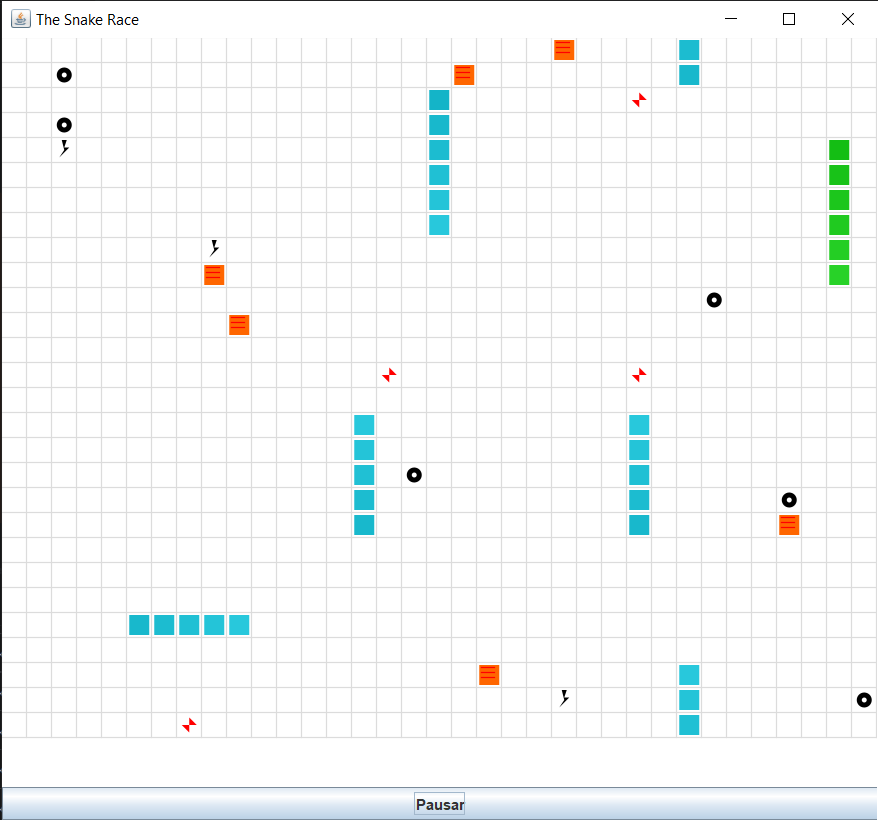
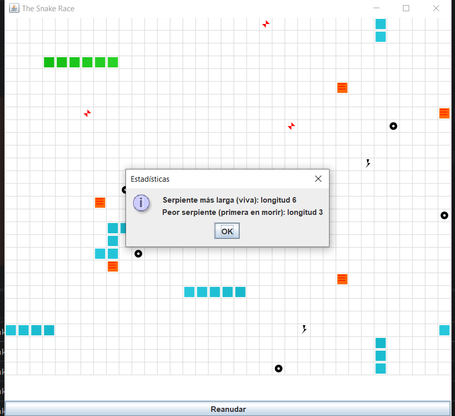
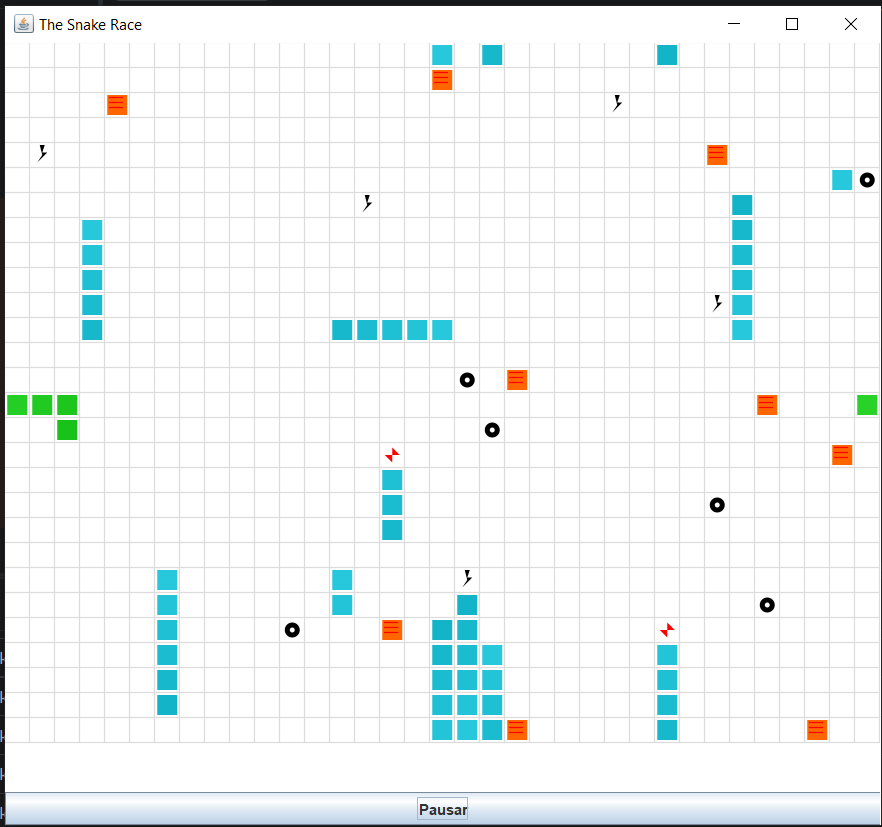
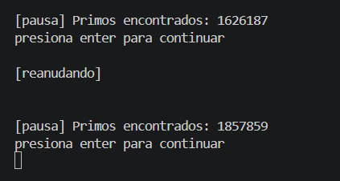
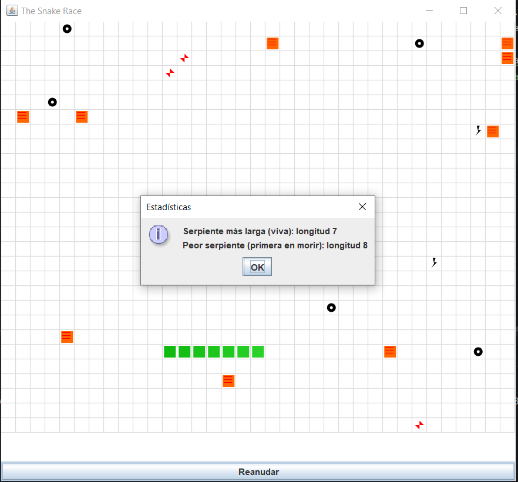

# Snake Race — ARSW Lab #2 (Java 21, Virtual Threads)

**Escuela Colombiana de Ingeniería – Arquitecturas de Software**  
Laboratorio de programación concurrente: condiciones de carrera, sincronización y colecciones seguras.

---

## Requisitos

- **JDK 21** (Temurin recomendado)
- **Maven 3.9+**
- SO: Windows, macOS o Linux

---

## Cómo ejecutar

```bash
mvn clean verify
mvn -q -DskipTests exec:java -Dsnakes=4
```

- `-Dsnakes=N` → inicia el juego con **N** serpientes (por defecto 2).
- **Controles**:
  - **Flechas**: serpiente **0** (Jugador 1).
  - **WASD**: serpiente **1** (si existe).
  - **Espacio** o botón **Action**: Pausar / Reanudar.

---

## Reglas del juego (resumen)

- **N serpientes** corren de forma autónoma (cada una en su propio hilo).
- **Ratones**: al comer uno, la serpiente **crece** y aparece un **nuevo obstáculo**.
- **Obstáculos**: si la cabeza entra en un obstáculo hay **rebote**.
- **Teletransportadores** (flechas rojas): entrar por uno te **saca por su par**.
- **Rayos (Turbo)**: al pisarlos, la serpiente obtiene **velocidad aumentada** temporal.
- Movimiento con **wrap-around** (el tablero “se repite” en los bordes).

---

## Arquitectura (carpetas)

```
co.eci.snake
├─ app/                 # Bootstrap de la aplicación (Main)
├─ core/                # Dominio: Board, Snake, Direction, Position
├─ core/engine/         # GameClock (ticks, Pausa/Reanudar)
├─ concurrency/         # SnakeRunner (lógica por serpiente con virtual threads)
└─ ui/legacy/           # UI estilo legado (Swing) con grilla y botón Action
```

---

# Actividades del laboratorio

## Parte I — (Calentamiento) `wait/notify` en un programa multi-hilo

1. Toma el programa [**PrimeFinder**](https://github.com/ARSW-ECI/wait-notify-excercise).
2. Modifícalo para que **cada _t_ milisegundos**:
   - Se **pausen** todos los hilos trabajadores.
   - Se **muestre** cuántos números primos se han encontrado.
   - El programa **espere ENTER** para **reanudar**.
3. La sincronización debe usar **`synchronized`**, **`wait()`**, **`notify()` / `notifyAll()`** sobre el **mismo monitor** (sin _busy-waiting_).
4. Entrega en el reporte de laboratorio **las observaciones y/o comentarios** explicando tu diseño de sincronización (qué lock, qué condición, cómo evitas _lost wakeups_).

> Objetivo didáctico: practicar suspensión/continuación **sin** espera activa y consolidar el modelo de monitores en Java.

---

## Parte II — SnakeRace concurrente (núcleo del laboratorio)

### 1) Análisis de concurrencia

- Explica **cómo** el código usa hilos para dar autonomía a cada serpiente.
- **Identifica** y documenta en **`el reporte de laboratorio`**:
  - Posibles **condiciones de carrera**.
  - **Colecciones** o estructuras **no seguras** en contexto concurrente.
  - Ocurrencias de **espera activa** (busy-wait) o de sincronización innecesaria.

### 2) Correcciones mínimas y regiones críticas

- **Elimina** esperas activas reemplazándolas por **señales** / **estados** o mecanismos de la librería de concurrencia.
- Protege **solo** las **regiones críticas estrictamente necesarias** (evita bloqueos amplios).
- Justifica en **`el reporte de laboratorio`** cada cambio: cuál era el riesgo y cómo lo resuelves.

### 3) Control de ejecución seguro (UI)

- Implementa la **UI** con **Iniciar / Pausar / Reanudar** (ya existe el botón _Action_ y el reloj `GameClock`).
- Al **Pausar**, muestra de forma **consistente** (sin _tearing_):
  - La **serpiente viva más larga**.
  - La **peor serpiente** (la que **primero murió**).
- Considera que la suspensión **no es instantánea**; coordina para que el estado mostrado no quede “a medias”.

### 4) Robustez bajo carga

- Ejecuta con **N alto** (`-Dsnakes=20` o más) y/o aumenta la velocidad.
- El juego **no debe romperse**: sin `ConcurrentModificationException`, sin lecturas inconsistentes, sin _deadlocks_.
- Si habilitas **teleports** y **turbo**, verifica que las reglas no introduzcan carreras.

> Entregables detallados más abajo.

---

## Entregables

1. **Código fuente** funcionando en **Java 21**.
2. Todo de manera clara en **`**el reporte de laboratorio**`** con:
   - Data races encontradas y su solución.
   - Colecciones mal usadas y cómo se protegieron (o sustituyeron).
   - Esperas activas eliminadas y mecanismo utilizado.
   - Regiones críticas definidas y justificación de su **alcance mínimo**.
3. UI con **Iniciar / Pausar / Reanudar** y estadísticas solicitadas al pausar.

---

## Criterios de evaluación (10)

- (3) **Concurrencia correcta**: sin data races; sincronización bien localizada.
- (2) **Pausa/Reanudar**: consistencia visual y de estado.
- (2) **Robustez**: corre **con N alto** y sin excepciones de concurrencia.
- (1.5) **Calidad**: estructura clara, nombres, comentarios; sin _code smells_ obvios.
- (1.5) **Documentación**: **`reporte de laboratorio`** claro, reproducible;

---

## Tips y configuración útil

- **Número de serpientes**: `-Dsnakes=N` al ejecutar.
- **Tamaño del tablero**: cambiar el constructor `new Board(width, height)`.
- **Teleports / Turbo**: editar `Board.java` (métodos de inicialización y reglas en `step(...)`).
- **Velocidad**: ajustar `GameClock` (tick) o el `sleep` del `SnakeRunner` (incluye modo turbo).

---

## Cómo correr pruebas

```bash
mvn clean verify
```

Incluye compilación y ejecución de pruebas JUnit. Si tienes análisis estático, ejecútalo en `verify` o `site` según tu `pom.xml`.

---

## Créditos

Este laboratorio es una adaptación modernizada del ejercicio **SnakeRace** de ARSW. El enunciado de actividades se conserva para mantener los objetivos pedagógicos del curso.

**Base construida por el Ing. Javier Toquica.**
# Snake Race — ARSW Lab #2 (Java 21, Virtual Threads)

**Escuela Colombiana de Ingeniería ARSW**  

---

## Cómo ejecutar

```bash
mvn clean verify
mvn -q -DskipTests exec:java -Dsnakes=4
```

- `-Dsnakes=N` → inicia el juego con **N** serpientes (por defecto 2).
- **Controles**:
    - **Flechas**: serpiente 0 (Jugador 1).
    - **WASD**: serpiente 1 (Jugador 2).
    - **Espacio** o botón **Pausar**: Pausar / Reanudar.

---

## Evidencia de ejecución

### Juego corriendo con múltiples serpientes


### Estadísticas al pausar


### Juego con 20 serpientes (-Dsnakes=20)


### PrimeFinder pausando cada 5 segundos


---

## Parte I — PrimeFinder (wait/notify)

### Diseño de sincronización

Se creó la clase `PauseMonitor` como monitor compartido entre el `Control` y los `PrimeFinderThread`.

**¿Qué lock se usa?**  
El monitor es la instancia de `PauseMonitor`, compartida entre todos los hilos.

**¿Qué condición se espera?**  
La variable booleana `paused`. Cada hilo trabajador la consulta al inicio de cada iteración.

**¿Cómo se evitan lost wakeups?**  
Usando `while` en vez de `if`:

```java
public synchronized void checkPause() throws InterruptedException {
    while (paused) {   // while, no if → evita lost wakeups
        wait();        // bloquea sin busy-wait
    }
}
```

Si se usara `if`, un `notifyAll()` que llegara justo antes del `wait()` se perdería. Con `while`, aunque el hilo se despierte de más, vuelve a verificar la condición.

**Flujo:**
```
Control.run():
  Thread.sleep(5000)    -> espera 5 segundos ->monitor.pause() -> paused = true -> mostrar primo -> lectura segura (hilos en wait()) -> scanner.nextLine()     -> espera ENTER -> monitor.resume()       -> notifyAll() despierta los hilos
```

**¿Por qué la lectura es segura sin cambiar LinkedList?**  
Cuando `Control` lee `getPrimes().size()`, los hilos están bloqueados en `wait()` — nadie está ejecutando `primes.add()`. La pausa actúa como barrera natural.

---

## Parte II — SnakeRace concurrente

### 1) Análisis de concurrencia

#### ¿Cómo usa hilos el código?

Cada serpiente corre en su propio **virtual thread** (Java 21):

```java
var exec = Executors.newVirtualThreadPerTaskExecutor();
snakes.forEach(s -> exec.submit(new SnakeRunner(s, board, clock)));
```

`SnakeRunner` implementa `Runnable` y contiene el loop autónomo de cada serpiente — gira aleatoriamente, avanza, reacciona a eventos del tablero.

#### Condiciones de carrera identificadas

| Clase | Problema | Riesgo |
|---|---|---|
| `Snake` | `ArrayDeque body` no thread-safe | `ConcurrentModificationException` al leer desde UI mientras se escribe |
| `Snake` | `turn()` no atómica | Dirección inconsistente entre hilo UI y SnakeRunner |
| `SnakeApp` | `togglePause()` no pausaba los `SnakeRunner` | Serpientes seguían moviéndose al pausar |
| `Board` | Bien sincronizado con `synchronized` | Sin riesgo |

#### Colecciones no seguras

`Snake.body` es un `ArrayDeque` — no thread-safe. Dos actores la acceden simultáneamente:
- `SnakeRunner` → llama `snake.advance()` → escribe en `body`
- UI (`paintComponent`) → llama `snake.snapshot()` → lee `body`

Esto causa `ConcurrentModificationException` sin sincronización.

#### Espera activa (busy-wait)

El `SnakeRunner` original no tenía mecanismo de pausa:

```java
// ANTES — sin pausa, corre indefinidamente
while (!Thread.currentThread().isInterrupted()) {
    maybeTurn();
    board.step(snake);
    Thread.sleep(sleep);
}
```

No había busy-wait explícito pero tampoco había forma de pausar los hilos — al llamar `clock.pause()` solo se detenía el repintado, no el movimiento.

---

### 2) Correcciones mínimas y regiones críticas

#### `Snake.java` — protección del ArrayDeque

**Riesgo:** `snapshot()` y `advance()` accedidos simultáneamente desde hilos distintos.  
**Solución:** `synchronized` en todos los métodos que acceden a `body`:

```java
public synchronized Deque<Position> snapshot() {
    return new ArrayDeque<>(body); // copia defensiva
}

public synchronized void advance(Position newHead, boolean grow) {
    body.addFirst(newHead);
    if (grow) maxLength++;
    while (body.size() > maxLength) body.removeLast();
}

public synchronized void turn(Direction dir) { ... }
public synchronized Position head() { ... }
```

**Justificación del alcance mínimo:** Solo se sincroniza sobre `body` — no se bloquea todo el objeto innecesariamente.

#### `GameClock.java` — pausa coordinada

**Riesgo:** `pause()` y `resume()` modifican estado compartido; `SnakeRunner` necesita bloquearse al pausar.  
**Solución:** `synchronized` + `notifyAll()`:

```java
public synchronized void pause() {
    state.set(GameState.PAUSED);
}

public synchronized void resume() {
    state.set(GameState.RUNNING);
    notifyAll(); // despierta todos los SnakeRunner en wait()
}

public boolean isPaused() {
    return state.get() == GameState.PAUSED;
}
```

#### `SnakeRunner.java` — punto de pausa sin busy-wait

**Riesgo:** Sin pausa, los hilos seguían corriendo aunque el juego estuviera pausado.  
**Solución:** `wait()` sobre el monitor del clock:

```java
synchronized (clock) {
    while (clock.isPaused()) {
        clock.wait(); // bloquea sin consumir CPU
    }
}
```

**¿Por qué `while` y no `if`?**  
Evita lost wakeups — si el hilo se despierta espuriamente, vuelve a verificar la condición.

#### `Board.java` — colisiones entre serpientes

**Riesgo:** Sin detección de colisiones, las serpientes se atravesaban entre sí.  
**Solución:** Registro de serpientes y verificación en `step()`:

```java
for (Snake other : snakes) {
    if (other != snake && other.isAlive()) {
        if (other.snapshot().contains(next)) {
            snake.die();
            return MoveResult.DIED;
        }
    }
}
```

---

### 3) Control de ejecución seguro (UI)

- Botón **Pausar/Reanudar** implementado en `SnakeApp.togglePause()`.
- Al pausar, los `SnakeRunner` se bloquean en `clock.wait()` antes de ejecutar `board.step()` — el estado del tablero queda consistente.
- Se muestra un `JOptionPane` con:
    - **Serpiente viva más larga** — filtrada por `isAlive()`, ordenada por `length()`
    - **Peor serpiente** — la que murió primero, ordenada por `getDeathTime()`

### Evidencia UI

#### Botón Pausar/Reanudar


#### JOptionPane con estadísticas


---

### 4) Robustez bajo carga

Se ejecutó con `-Dsnakes=20` sin errores:
- Sin `ConcurrentModificationException`
- Sin deadlocks
- Sin lecturas inconsistentes
- Teleports y turbo funcionan sin introducir carreras adicionales

### Evidencia robustez


